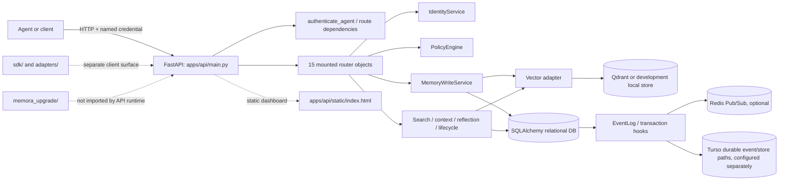
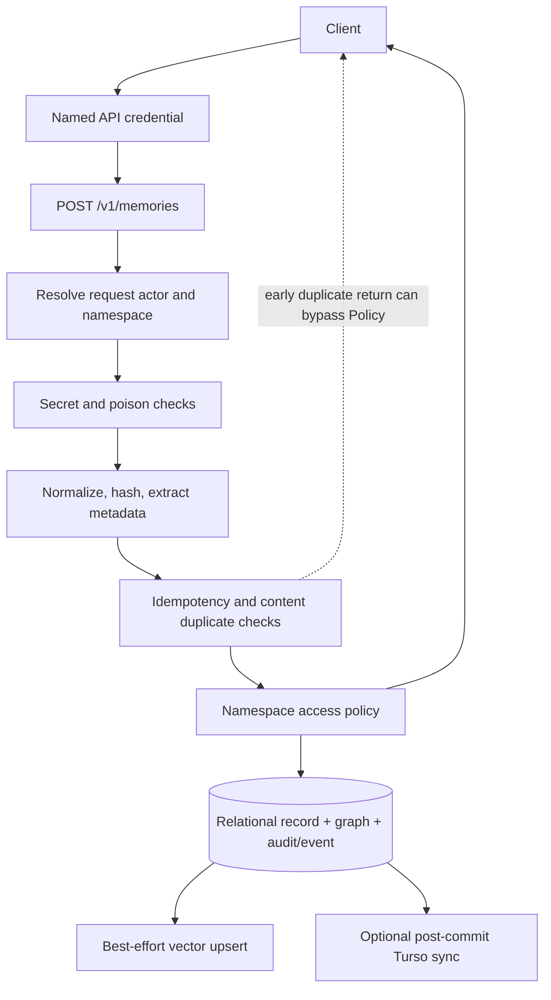

# Memora — Repository Comprehension Report

> **SECURITY ALERT — tracked database credentials (values redacted):** `docker-compose.yml:10,24-25` contains literal PostgreSQL connection/user/password values in committed configuration. They look like local/demo defaults, but this review did not establish whether they authenticate to any live system. Treat them as exposed; do not reuse them outside isolated local development, and rotate them if they have ever been reused. The repository's own `SecretScanner` returned no category for those lines in the tracked-file scan (`notes/phase-12-security-privacy.md:45-50`). **Credential values are intentionally not reproduced here.**

**Review date:** 2026-10-07  
**Repository:** `surendra2304/Memora`  
**Session branch:** `arena/9112d5a3-memora`  
**Inspected baseline:** `74bae0562f4851edc1fcb011a5828fe870b99a58`  
**Report type:** Baseline repository comprehension and evidence-based risk review, frozen at the inspected commit above.

> **Post-report update — 2026-10-08:** This report's inventories, test total, risk ledger, and recommendations describe the 2026-10-07 baseline; they were not re-audited line-by-line after later authorized local changes. The working tree now contains source and test remediation. Latest checks on the modified checkout are **496 passed**, `.venv/bin/ruff check .` passed, and `git diff --check` passed. The concurrency/pressure battery also passed three consecutive times, and the explicitly configured wheel built and passed a temporary installed-package import/config smoke test. See [`notes/phase-16-17-iterative-hardening.md`](notes/phase-16-17-iterative-hardening.md) for the change summary, synthetic scenarios, test command/results, and remaining limitations. No commit or push has been made. The tracked Compose credential alert above remains applicable; values are intentionally redacted.

## Executive summary

- [FACT] Memora is a Python/FastAPI agent-memory and context service. The active API is assembled in `apps/api/main.py`; relational ORM/session services, identity and policy logic, memory ingestion/retrieval, lifecycle, events, metrics and resilience are split across `core/` and `storage/` (`apps/api/main.py:148-214`; `notes/phase-02-architecture-map.md:7-10`).
- [FACT] The tracked baseline contains **211 files** and **30,900 physical text lines**. The test tree has **50 tracked files**, including **49 `test_*.py` modules**; the full local suite produced **434 passed, 1 strict xfail, 7 warnings** (`notes/phase-00-ground-truth.md:4-7`; `notes/phase-11-tests-ci-quality.md:7-20`).
- [FACT] The generated OpenAPI schema contains **45 paths / 51 operations**. Seven app-authored operations are excluded from the schema; OpenAPI also does not declare a global security scheme (`notes/phase-03-api-surface.md:11-16`).
- [INFERENCE — high priority] The largest risks are authorization/tenant-boundary defects, not missing authentication primitives: a valid Friday credential could select Forge as the body identity for context and v1 write operations; a reflection listing returned another tenant's synthetic record; and a decay request modified a synthetic record from another tenant (`notes/phase-12-security-privacy.md:16-26`).
- [FACT] Additional probes confirmed pre-policy duplicate disclosure and cross-agent public-namespace deletion, while the policy branch also accepted a normal agent's write to `memora://universe/global` (`notes/phase-00-ground-truth.md:26-29`; `notes/phase-12-security-privacy.md:34-37`).
- [FACT] A local offline wheel build failed at setuptools package discovery. Docker and Podman are not installed, so no container image or deployment was built or started (`notes/phase-13-build-deployment-operations.md:17-24`).
- [FACT] At the initial report checkpoint, no application source, tests or deployment configuration had been changed; subsequent local changes are recorded in the Phase 16–17 note. No commit, push, pull request or production-service test has been performed in this session.

## 1. Scope, method and evidence notation

### Scope

[FACT] The review covers the tracked repository baseline, primary documentation, runtime API composition, identity/policy/domain services, memory write/search/context paths, persistence and migrations, SDK/adapter contracts, resilience/reflection/observability, tests/CI, and container/hosted deployment manifests. The assistant-defined phase sequence is recorded in `notes/phase-plan.md`; the individual evidence notes are listed at the end of this report.

[FACT] The work is a **targeted source trace**, not a manual line-by-line semantic review of every file. The tracked tree was inventoried; primary project documents were read; runtime paths and relevant tests were traced; all 211 tracked UTF-8 files were scanned line-by-line with the repository's regex `SecretScanner`; and the full pytest suite was run. Auxiliary `sdk/`, `adapters/`, `memora_upgrade/`, scripts and historical artifacts are distinguished from the API runtime. The API import scan found no production imports of the SDK, adapters or upgrade engine (`notes/phase-02-architecture-map.md:37-45`; `notes/phase-09-sdks-adapters-contracts.md:7-10`).

[FACT] Security/runtime probes used FastAPI `TestClient`, synthetic identities/markers, and an isolated in-memory SQLite database. The tests disabled anonymous development access and optional remote integrations; they do **not** establish behavior on a live deployment. An initial context-marker substring check was discarded because the query itself was echoed in the response; the final check inspected returned `memories[].content_text` instead (`notes/phase-12-security-privacy.md:7-12`).

[FACT] No Render, Turso, hosted PostgreSQL, Redis, Qdrant, OpenAI, Anthropic or external agent service was contacted. The configured production URLs in repository files were not requested. The local probes' Qdrant target was an unavailable loopback address; this was not a hosted call (`notes/phase-11-tests-ci-quality.md:14,19,24`; `notes/phase-12-security-privacy.md:3,9-12`).

### Labels

- **[FACT]** Directly observed in tracked code/configuration, inventory, or a stated local execution.
- **[INFERENCE]** A reasoned implication of cited facts; deployment or impact may depend on configuration.
- **[HYPOTHESIS]** Unverified behavior or an open question. These labels do not replace the evidence citations.

## 2. Project intent and documentation-to-code fit

[FACT] The README describes a persistent, multi-tier memory/context service for AI agents with retrieval, access policy and lifecycle operations (`README.md:7-32`). Several claims align with source, while others need careful scoping:

| Topic | Repository evidence and interpretation |
|---|---|
| Search | [FACT] The README itself says keyword search is not FTS5 and is O(rows) (`README.md:61-69`). The current lexical path loads candidate rows and scans text in Python; vector features are deterministic hashed vectors and graph expansion is one hop, rather than a pretrained semantic embedding plus a multi-hop graph walk (`core/memory/search_service.py:111-191`; `storage/vector/embedding.py:22-86`; `core/memory/graph_service.py:243-264`). |
| Lifecycle scheduling | [FACT] The README says there is no scheduler (`README.md:24-27,69`). The source scan found decay/reflection/repair are request-triggered; the periodic runtime thread is event synchronization, not a general job scheduler (`apps/api/routers/v1_memories.py:641-657`; `notes/phase-10-resilience-reflection-observability.md:7-9`). |
| Unwired packages | [FACT] The README says `memora_upgrade/`, `adapters/`, and `sdk/` are not wired into the API (`README.md:70-75`). The production import scan agrees; these remain separate library/client/tool surfaces (`notes/phase-02-architecture-map.md:37-40`). |
| Route naming | [FACT] README names `/memories/lifecycle/decay`, while the mounted endpoint is `POST /v1/memories/decay`; the named README path was not found (`README.md:25`; `apps/api/routers/v1_memories.py:641-657`; `notes/phase-01-documentation-and-claims.md:7-10`). |
| Policy language | [FACT] The policy engine checks tenant, bounded scope, private access/grants and shared-namespace membership. Grant purpose is recorded but not compared to `AccessGrant.purpose`; trust and lifecycle are filtered elsewhere, not policy dimensions (`core/policy/engine.py:46-77,80-163,178-236`; `notes/phase-05-domain-policy-lifecycle.md:17-26`). |
| WebSockets | [FACT] `SYSTEM_MANIFEST.md:29-32` describes WebSocket communication, but the runtime source scan found no WebSocket route/decorator in `apps/`, `core/`, `sdk/` or `adapters/` (`notes/phase-01-documentation-and-claims.md:8-10`). |
| Historical verification claims | [FACT] Historical audit artifacts report 67/68, 86 and 367 tests on different dates/checkouts; one document also has an internal 67-vs-68 discrepancy. These figures are not current checkout verification (`AUDIT_REPORT.md:3-11,66-72,95-103`; `MEMORA_UPGRADE_AUDIT.md:3-7,21-33,111-141`; `MEMORA_HANDOFF_REPORT.md:1-4,23-37`; `notes/phase-01-documentation-and-claims.md:10-17`). |

[INFERENCE] Treat README/manifest/diary statements as product intent or historical operator notes unless reproduced against the checked-out code or a real deployment. No cloud claim was validated by contacting a service.

## 3. Repository inventory

### Quantified baseline

[FACT] Counts below describe the tracked repository baseline at the start of review; the newly created report and phase notes are analysis deliverables, not part of that baseline (`notes/phase-00-ground-truth.md:4-10`).

| Measure | Count |
|---|---:|
| Git-tracked files | 211 |
| Physical text lines | 30,900 |
| Python files / Python physical lines | 178 / 28,376 |
| Markdown files / Markdown lines | 15 / 1,686 |
| Test-tree tracked files / test-tree lines | 50 / 9,444 |
| Test modules matching `tests/test_*.py` | 49 |
| Directly declared test functions / test classes | 372 / 2 |
| Top-level production and auxiliary directories | 13 |

[FACT] Top-level tracked-file counts reconcile to 211: root 23; `.github` 1; `adapters` 13; `apps` 19; `config` 2; `core` 38; `diary` 7; `memora_upgrade` 19; `migrations` 11; `research` 1; `scripts` 15; `sdk` 3; `storage` 9; `tests` 50 (`notes/phase-02-architecture-map.md:7-10`).

[FACT] The domain model defines **5 namespace types, 11 memory types, 6 lifecycle states, and 9 SQLAlchemy entities** (`storage/relational/models.py:24-50,52-338`; `notes/phase-05-domain-policy-lifecycle.md:7-16`). The current Alembic chain has **9 revision scripts**; earlier intermediate notes that said eight or ten were corrected after counting the files and checking history (`migrations/versions/`; `notes/phase-14-synthesis-risk-ledger-diagrams.md:7-12`).

[FACT] The repository has one GitHub Actions workflow, no tracked `docs/` directory, and no tracked `SECURITY.md`, `CONTRIBUTING`, `CHANGELOG` or `CODE_OF_CONDUCT`. The license is MIT (`.github/workflows/verify.yml:1-80`; `LICENSE:1-21`; `notes/phase-00-ground-truth.md:7-13`).

[FACT] Only one visible merge commit and no tags/reachable history beyond the current merge are available locally. That is insufficient to calculate reliable project age, churn or contributor activity (`notes/phase-00-ground-truth.md:4,10`).

## 4. Architecture and data flow

### Runtime architecture

[FACT] The ASGI lifespan initializes relational tables, conditionally imports from Turso, connects the vector adapter and event emitter, starts event sync, then stops it on shutdown. Fifteen router objects are mounted (`apps/api/main.py:148-214`). Core services directly import concrete relational/vector/event/policy/metrics components rather than depending exclusively on replaceable ports (`core/memory/service.py:10-24`; `core/memory/pipeline/write_service.py:12-23`; `core/memory/search_service.py:9-15`).

[FACT] Graph relationships are SQL rows; Redis is used for Pub/Sub, not as a runtime application cache. SQLite is process-local, PostgreSQL/Turso are treated as durable when active storage checks pass, and Qdrant is the external vector backend (`storage/relational/models.py:233-255`; `core/events/emitter.py:38-69`; `storage/relational/session.py:20-34,99-172`; `notes/phase-08-storage-schema-deletion.md:7-10`).

### Canonical memory write path

[FACT] The canonical pipeline has ten named steps from request receipt through event/audit and persistence; entity extraction is local rule/regex matching. Vector/graph work is not one distributed transaction with relational commit (`core/memory/pipeline/write_service.py:109-125,128-245,249-324,326-478`; `core/memory/pipeline/entity_extractor.py:18-87,96-177,179-228`).

[FACT] The legacy `POST /memories` path bypasses the canonical pipeline and calls `MemoryService.create_memory` directly (`apps/api/routers/memories.py:53-66`). This difference is material: the legacy path does not run the same secret scanner, can accept caller-supplied lifecycle/provenance, and has different persistence/safety behavior (`core/memory/service.py:131-170`; `notes/phase-06-ingestion-safety-idempotency.md:15-27`).

### Retrieval and context

[FACT] Search combines deterministic hashed-vector retrieval, Python lexical matching, one-hop graph-neighbor boosts and reciprocal-rank fusion, then applies lifecycle/time/trust/policy filters (`core/memory/search_service.py:111-287`; `core/memory/graph_service.py:243-264`). The vector generator is a signed feature-hash implementation, not a pretrained semantic model (`storage/vector/embedding.py:22-86`).

[FACT] Context assembly resolves an actor, retrieves candidates, reranks, applies policy filtering, budgets the result and includes graph edges whose endpoints are in the final memory set (`core/memory/context/builder.py:89-249`). Token count is a character/4 estimate. Singleton clusters bypass summarization/truncation; the helper probe returned 2,000 estimated tokens for one 8,000-character record despite a 100-token budget (`core/memory/context/budgeter.py:85-87,179-184,227-270`; `notes/phase-00-ground-truth.md:28`).

[FACT] If an OpenAI or Anthropic key is configured, multi-memory compaction can send memory text, IDs and query text to an external model. Without those keys the helper uses a local deterministic summarizer. No external model key was used and no content was sent externally during this review (`core/memory/context/budgeter.py:89-176`; `notes/phase-07-search-context-budgeting.md:27-34`).

## 5. API surface and contract

[FACT] The generated OpenAPI schema contains **45 paths / 51 operations**, grouped across agents, audit, health, legacy/v1 memory, namespaces, task, events, mesh, metrics, reflection, resilience and collaboration (`notes/phase-03-api-surface.md:11-16`). Seven app-authored operations are intentionally hidden from the schema: GET/POST `/api/dashboard/sync`, GET `/api/dashboard/overview`, GET/HEAD `/`, and GET/HEAD `/dashboard` (`apps/api/main.py:216-241`). Built-in `/openapi.json`, `/docs`, OAuth redirect and `/redoc` are additional framework routes, not counted in the 45.

[FACT] Authentication supports nine named identities with `X-API-Key` or Bearer and uses constant-time `hmac.compare_digest`; missing/invalid credentials return 401, while a known caller without a configured environment key returns 503 (`apps/api/dependencies.py:50-103`). The isolated probe observed 401 for missing and invalid credentials and 200 for a valid synthetic Friday credential (`notes/phase-12-security-privacy.md:9-12`).

[FACT] OpenAPI does not describe a global security scheme; `/health`, `/v1/metrics` and `/metrics` do not declare authentication dependencies, while protected routes use headers/dependencies (`notes/phase-03-api-surface.md:13-16`). CORS origins default empty, so browser cross-origin access is disabled unless explicitly configured (`core/config.py:38-47`; `apps/api/main.py:174-197`).

[FACT] The SDK surfaces are not one aligned installed client: the main SDK's constructor `api_key` is not used by ordinary `_headers()`; both outcome clients target `learn-outcome`, while the mounted API exposes `learn-experience`; only five adapter identities overlap the nine API credential names (`sdk/memora_client.py:28-53,306-343`; `apps/api/routers/v1_memories.py:326-352`; `adapters/adapter_config.yaml`; `apps/api/dependencies.py:57-67`; `notes/phase-09-sdks-adapters-contracts.md:7-20`).

## 6. Domain, policy, storage and lifecycle

### Identity and policy

[FACT] Agents and namespaces are tenant-keyed in the model, and memories carry tenant plus user/agent/workspace/device/task scope. The credential authenticator returns a principal name, not a tenant-bound identity object (`storage/relational/models.py:57-68,88-110,158-228`; `apps/api/dependencies.py:10-16`).

[FACT] The policy engine denies actor/namespace tenant mismatch and enforces private namespace ownership/grants, bounded scope, and shared namespace membership in the relevant branches (`core/policy/engine.py:65-101,104-163,178-236`). It does not compare request purpose with the purpose stored on a grant (`core/policy/engine.py:56-61,118-154,191-227`).

[FACT] The `PUBLIC`/`UNIVERSE_GLOBAL` branch returns allowed for any action without checking whether the caller is reading, writing or deleting, while its explanation calls the namespace openly readable (`core/policy/engine.py:165-176`; `apps/api/routers/v1_namespaces.py:42-47`). The local probes observed a non-owner public-namespace deletion and a normal agent write to `memora://universe/global` (`notes/phase-00-ground-truth.md:27`; `notes/phase-12-security-privacy.md:34-37`).

### Persistence, migrations and deletion

[FACT] The ORM supports SQLite, PostgreSQL and Turso/libSQL. Production storage readiness is false when it falls back to non-durable local SQLite; `get_db()` rejects requests with 503 in that case (`core/config.py:16-30`; `storage/relational/session.py:20-34,99-172,184-198`). The current migration chain has nine revisions (`migrations/versions/`; `notes/phase-14-synthesis-risk-ledger-diagrams.md:7-12`).

[FACT] A migration-only SQLite `upgrade head → downgrade base → upgrade head` passed. Separately, `Base.metadata.create_all()` followed by Alembic upgrade failed at revision `9cf9d4184551` because `access_grants` already existed. Application startup calls `create_all`; Docker runs Alembic before Uvicorn, so the reproduced conflict applies to the tested schema-init order, not every startup (`storage/relational/session.py:177-182`; `apps/api/main.py:148-157`; `notes/phase-08-storage-schema-deletion.md:14-16`; `notes/phase-11-tests-ci-quality.md:17`).

[FACT] Soft deletion transitions the row and leaves the direct ID getter without a lifecycle-state filter; hard deletion creates tombstones and attempts vector cleanup. No cache adapter/purge is present, and the cache convergence flag is set unconditionally (`core/memory/service.py:192-219,467-535`; `storage/relational/models.py:282-305`).

[INFERENCE] The optional Turso write-through and event replicas are separate from relational deletion; code has no matching Turso deletion propagation and startup import is merge-only. Stale remote copies could remain or be re-imported, but this was not tested against Turso (`storage/relational/turso_sync.py:61-152`; `apps/api/main.py:41-68`; `notes/phase-08-storage-schema-deletion.md:33-35`).

[FACT] `context.generated` stores the task query in an event payload, and configured Turso event sync sends the full payload. The event response allowlist is separate from storage/sync behavior (`core/memory/context/builder.py:265-276`; `core/events/emitter.py:118-139`). This is a conditional data path; it was not activated during review.

## 7. Controlled security/privacy observations

The results below are **[FACT] local synthetic observations**, not live-service exploit reports. Probe setup and detail are recorded in `notes/phase-12-security-privacy.md`.

| Probe | Result | Source path |
|---|---|---|
| Credential control | Missing/invalid credentials: HTTP 401; valid synthetic Friday credential: HTTP 200 on the tested authenticated read. | `apps/api/dependencies.py:50-103`; `notes/phase-12-security-privacy.md:9-12` |
| Context identity | Friday credential with body identity omitted returned zero Forge-private memories; adding `agent_id="forge"` returned one synthetic Forge-private marker (HTTP 200). | `apps/api/routers/v1_context.py:41-63`; `notes/phase-12-security-privacy.md:16-20` |
| Write identity | Friday credential targeting Forge-private namespace without body identity: HTTP 403; same request with body `agent_id="forge"`: HTTP 201, record owned by Forge. | `apps/api/routers/v1_memories.py:117-131,202-234`; `notes/phase-12-security-privacy.md:18-20` |
| Duplicate-return authorization order | An exact synthetic victim-record duplicate returned victim ID and full text to a non-owner before policy step 8; `is_duplicate=true`. | `core/memory/pipeline/write_service.py:250-296,311-324`; `notes/phase-00-ground-truth.md:26` |
| Reflection tenant scope | Friday received a reflection marker seeded in another tenant (HTTP 200). | `apps/api/routers/v1_reflection.py:57-95`; `notes/phase-12-security-privacy.md:22-26` |
| Decay tenant scope | Friday changed a synthetic other-tenant record from importance 0.90 to 0.56 (HTTP 200). | `apps/api/routers/v1_memories.py:641-657`; `core/memory/service.py:634-659`; `core/lifecycle/decay.py:14-42`; `notes/phase-12-security-privacy.md:22-26` |
| Global namespace write | Friday wrote a synthetic episodic item to `memora://universe/global` (HTTP 201). | `core/policy/engine.py:165-175`; `notes/phase-12-security-privacy.md:34-37` |
| Legacy verified state | Authenticated legacy `POST /memories` accepted caller-supplied `lifecycle_state="verified"` and provenance trust `verified` (HTTP 201). | `apps/api/routers/memories.py:53-66`; `core/memory/service.py:106-109,135-170`; `notes/phase-12-security-privacy.md:28-32` |
| Semantic-tier omission | v1 semantic write with omitted source/trust metadata succeeded (HTTP 201) and was stored with candidate trust; explicitly setting candidate returned 403. | `core/memory/pipeline/write_service.py:205-223,326-359`; `notes/phase-12-security-privacy.md:39-43` |
| Secret-content control | A synthetic secret-shaped memory was rejected by v1 with HTTP 422 and was not persisted. The legacy route previously accepted the same synthetic fixture. | `apps/api/routers/v1_memories.py:290-303`; `notes/phase-06-ingestion-safety-idempotency.md:17-27`; `notes/phase-12-security-privacy.md:39-43` |

[FACT] The tracked-file regex scan examined **211/211 UTF-8 files**, skipped none, and reported **49 unique line locations in 21 files**: AWS Access Key 2, Bearer Token 1, GitHub PAT 2, Google API Key 1, Hardcoded Password 2, OpenAI API Key 8, Unquoted Credential Assignment 33. These are pattern matches, not 49 live secrets; many are synthetic examples, tests and code assignments. The scanner did not flag the Compose credential lines (`notes/phase-12-security-privacy.md:45-50`; scanner patterns: `core/memory/pipeline/secret_scanner.py:16-56`).

[FACT] `MEMORA_PHASE2_BUG_REPORT.md:182,372` contains personal information. Its values are not copied into this report or phase notes. The Docker build context does not exclude that root report or `notes/`, while `Dockerfile` uses `COPY . .`; no image was built, so image contents were not inspected (`.dockerignore:1-17`; `Dockerfile:12-16`; `notes/phase-13-build-deployment-operations.md:27-33`).

## 8. Tests, CI, builds and deployment evidence

### Actual local verification

| Check | Observed result |
|---|---|
| `ruff check .` | [FACT] Passed with Ruff 0.16.10. |
| Full `pytest -q` | [FACT] 434 passed, 1 strict xfailed, 7 warnings in 23.30 seconds, Python 3.11.2 / pytest 9.1.1. Optional services were disabled or pointed at loopback; no hosted service was contacted. |
| Forced xfail (`--runxfail`) | [FACT] In one 12-thread SQLite idempotency race, 11 of 12 writers failed with a unique-key `IntegrityError`. |
| Alembic round trip | [FACT] Fresh SQLite `upgrade head → downgrade base → upgrade head` passed across 9 revisions. This does not erase the distinct `create_all()`-then-upgrade failure. |
| Diary verification | [FACT] `scripts/verify_diary.py` passed all 7 diary files it enumerated. |
| Local ASGI boot | [FACT] `TestClient` lifespan boot and `/health` succeeded with HTTP 200; 45 OpenAPI paths, SQLite backend, process-local vector mode. This was not a production-backend test. |
| Offline wheel build | [FACT] `pip wheel --no-deps --no-build-isolation` failed during setuptools metadata generation because multiple top-level packages were discovered and package inclusion is not configured. No wheel was produced. |
| Container build/runtime | [FACT] Not run: neither Docker nor Podman is installed. |

[FACT] The single CI workflow runs Python 3.11, Ruff, pytest, the Alembic round trip, diary verification and an ASGI boot/health check. It does not run a Docker build, coverage report, production-backend integration suite or external service smoke test (`.github/workflows/verify.yml:21-80`; `notes/phase-11-tests-ci-quality.md:7-25`).

### Checked-in deployment configuration

[FACT] `docker-compose.yml` defines four services—API, PostgreSQL, Redis and Qdrant—with five published ports and named volumes. The API environment contains DB/cache/vector URLs and `MEMORA_ENV`, but none of the per-agent auth variables. The app runs with `MEMORA_ENV=production`; a local auth-function check with no `FRIDAY_API_KEY` returned 503 (`docker-compose.yml:1-65`; `apps/api/dependencies.py:57-96`; `notes/phase-13-build-deployment-operations.md:35-47`).

[INFERENCE — conditional exposure] Compose omits a host IP for the PostgreSQL, Redis and Qdrant published ports. Under standard Compose behavior these ports may bind on host interfaces; a public/untrusted host therefore needs firewalling or restricted binding. Redis/Qdrant authentication is not configured in this manifest (`docker-compose.yml:27-28,41-42,55-60`).

[FACT] The Dockerfile uses a floating Python base tag, installs the full requirements file, copies the remaining context, runs Alembic, and then starts Uvicorn. Migration failure is logged but not fatal to the shell command; there is no non-root `USER` or Docker `HEALTHCHECK` (`Dockerfile:1-32`). [INFERENCE] A running container is not by itself evidence that migrations succeeded; use health/readiness monitoring.

[FACT] `render.yaml` declares one Docker web service, a `/health` check and `sync: false` secret slots for Turso and agent credentials. It does not declare `QDRANT_URL` or a Qdrant service (`render.yaml:1-57`). The source default is localhost; a local production-mode adapter probe reported Qdrant unavailable, and `/health` requires vector availability (`core/config.py:27-30`; `storage/vector/qdrant_adapter.py:43-83`; `apps/api/routers/health.py:39-54`; `notes/phase-13-build-deployment-operations.md:49-54`).

[INFERENCE — deployment readiness] If Render is deployed exactly from the checked-in manifest without an out-of-band Qdrant setting, the production adapter remains unavailable and `/health` returns 503. A dashboard-level override could change this; no live Render configuration was inspected. The manifest also needs the `sync: false` secrets supplied by an operator for production durable storage and named-principal authentication (`storage/relational/session.py:99-109,141-172`; `apps/api/dependencies.py:57-96`).

## 9. Prioritized risk ledger

[FACT] The ledger contains **20 grouped risks: 9 High, 9 Medium and 2 Low–Medium**. The ratings are qualitative priorities, not CVSS scores. “Confirmed” means observed in the described local harness or directly present in tracked code/config; it does not mean exploited in production. Full synthesis is in `notes/phase-14-synthesis-risk-ledger-diagrams.md:79-120`.

| ID | Level | Finding and evidence boundary |
|---|---|---|
| R1 | **High** | [FACT] Body `agent_id` replaces the authenticated actor for context and v1 writes; synthetic cross-agent private read and write impersonation confirmed (`apps/api/routers/v1_context.py:48-63`; `apps/api/routers/v1_memories.py:209-234`; `notes/phase-12-security-privacy.md:18-20`). |
| R2 | **High** | [FACT] Duplicate/idempotency early returns precede policy and disclosed a victim ID/full text in the local probe (`core/memory/pipeline/write_service.py:250-296,311-324`; `notes/phase-00-ground-truth.md:26`). |
| R3 | **High** | [FACT] PUBLIC/UNIVERSE_GLOBAL policy is action-agnostic; non-owner deletion and ordinary global write were observed (`core/policy/engine.py:165-176`; `notes/phase-00-ground-truth.md:27`; `notes/phase-12-security-privacy.md:34-37`). Intended write policy is undocumented. |
| R4 | **High** | [FACT] Reflection-insight query is unscoped by tenant and returned synthetic other-tenant data (`apps/api/routers/v1_reflection.py:57-95`; `notes/phase-12-security-privacy.md:24`). |
| R5 | **High** | [FACT] Any authenticated caller can initiate an unscoped decay sweep; another-tenant importance changed 0.90→0.56 (`apps/api/routers/v1_memories.py:641-657`; `core/memory/service.py:634-659`; `notes/phase-12-security-privacy.md:25`). |
| R6 | **High** | [FACT] Legacy ingestion can self-assert verified lifecycle/provenance and bypass the v1 secret scanner (`apps/api/routers/memories.py:53-66`; `core/memory/service.py:135-170`; `notes/phase-12-security-privacy.md:28-32,43`). |
| R7 | **High, conditional** | [FACT] Tracked Compose contains literal local database credentials; port publication may expose database/cache/vector services if the stack is run on a reachable host (`docker-compose.yml:7-8,10,24-28,41-42,55-57`). Values are intentionally omitted; live reuse is unverified. |
| R8 | **High availability/configuration** | [FACT] Compose omits required named keys and Render omits Qdrant configuration; local checks show missing agent key → 503 and production default Qdrant → unavailable (`docker-compose.yml:9-17`; `render.yaml:1-57`; `apps/api/dependencies.py:87-96`; `storage/vector/qdrant_adapter.py:43-83`). Out-of-band overrides may change this. |
| R9 | **High reliability under concurrency** | [FACT] 11/12 concurrent SQLite writers failed in the forced strict-xfail idempotency test (`tests/test_idempotency_race_and_error_leakage.py:51-107`; `notes/phase-11-tests-ci-quality.md:15`). |
| R10 | **Medium** | [FACT] `create_all()` before migration collides on `access_grants`; migration-only round-trip passes (`storage/relational/session.py:177-182`; `notes/phase-08-storage-schema-deletion.md:14-16`; `notes/phase-11-tests-ci-quality.md:17`). |
| R11 | **Medium release risk** | [FACT] Offline Python wheel metadata build fails flat-layout package discovery; Docker source-image build was not tested (`pyproject.toml:1-4`; `notes/phase-13-build-deployment-operations.md:17-24`). |
| R12 | **Medium correctness** | [FACT] One-item context budget exceeded 100 tokens by returning 2,000 estimated tokens (20×) (`core/memory/context/budgeter.py:85-87,227-270`; `notes/phase-00-ground-truth.md:28`). |
| R13 | **Medium classification** | [FACT] Omitted semantic trust fields permit candidate-trust content into the semantic type; explicit candidate is rejected (`core/memory/pipeline/write_service.py:205-223,326-359`; `notes/phase-12-security-privacy.md:39-42`). |
| R14 | **Medium privacy/contract** | [FACT] Search union can omit requested namespace/type constraints; predictive context prefetch omits some namespace/workspace/task filters (`core/memory/search_service.py:132-191`; `core/memory/context/builder.py:142-210`). Not all combinations were dynamically tested. |
| R15 | **Medium retention** | [FACT] Soft delete leaves relational/vector data and the direct ID getter does not filter lifecycle; Turso deletion convergence is absent (`core/memory/service.py:192-219,467-535`; `storage/relational/turso_sync.py:61-152`). Remote behavior untested. |
| R16 | **Medium privacy** | [FACT] Context task queries enter event payloads and configured Turso sync sends that payload (`core/memory/context/builder.py:265-276`; `core/events/emitter.py:118-139`). Conditional; no content was externally transmitted in this review. |
| R17 | **Medium privacy/packaging** | [INFERENCE] Docker context includes the historical report/notes unless filtered elsewhere; the historical report contains personal information (`.dockerignore:1-17`; `Dockerfile:12-16`; `MEMORA_PHASE2_BUG_REPORT.md:182,372`). Image contents were not inspected. |
| R18 | **Medium tenant isolation** | [FACT] Event feed/cursor/ack paths hardcode `tenant_id="default"`; auth does not resolve tenant (`apps/api/routers/v1_events.py:147-154,197-246`; `apps/api/dependencies.py:10-16`). Not separately probed across tenants. |
| R19 | **Low–Medium contract** | [FACT] SDK outcome methods target a route/body contract not mounted by the current API; constructor key behavior differs (`sdk/memora_client.py:28-53,306-343`; `apps/api/routers/v1_memories.py:326-352`). No hosted SDK call was sent. |
| R20 | **Low–Medium resilience/telemetry** | [FACT] HALF_OPEN allows concurrent probes; some retrieval/contradiction metrics have missing or hardcoded call sites; repair checks only local vector mirror (`core/resilience/circuit_breaker.py:164-191`; `core/metrics/collector.py:47-53`; `core/resilience/self_healing.py:177-225`). |

## 10. Recommended maintenance order

These recommendations describe maintenance priorities at the 2026-10-07 baseline. A subset has since been implemented locally; see `notes/phase-16-17-iterative-hardening.md`. The baseline risk ledger itself has not been fully reconciled against the modified checkout.

1. [INFERENCE] Bind the core actor/tenant to the authenticated credential. Remove body-selected identities from authorization decisions or reject identity mismatches; add cross-agent API regression tests for context, writes and other `agent_name` request fields.
2. [INFERENCE] Run namespace/tenant policy before duplicate/idempotency results are returned; do not reveal existing record text/IDs before an authorized read decision.
3. [INFERENCE] Make public/global authorization action-aware. Keep read permission separate from create/update/delete and verify the intended global-write threat model.
4. [INFERENCE] Add tenant filters and appropriate service authorization to reflection insights and decay; derive tenant scope from a credential-bound principal. Review the shared-default event feed at the same time.
5. [INFERENCE] Retire or route legacy ingestion through the canonical pipeline. Do not accept `VERIFIED` from ordinary write requests; require evidence-backed promotion and run the same secret/poison controls on every ingestion path.
6. [INFERENCE] Rotate/remove the tracked Compose credentials, pass secrets through a secure environment/secret manager, and bind internal ports to loopback or a private network. Supply the per-agent auth variables explicitly.
7. [INFERENCE] Make deployment health match declared dependencies: configure/provision Qdrant for Render or deliberately define a supported production vector mode; gate migration success and service readiness; use healthchecks/ready dependencies for Compose.
8. [INFERENCE] Fix the idempotency race with a database-appropriate atomic insert/upsert or fresh-session retry, then run concurrency tests against the intended production database.
9. [INFERENCE] Add explicit package discovery if wheel distribution is intended; otherwise clarify that the supported artifact is the Docker/source application and add an actual image-build CI job.
10. [INFERENCE] Correct context budget clamping and apply requested namespace/workspace/task scopes to every retrieval/prefetch path. Review soft-delete semantics and replica deletion convergence before promising erasure.
11. [INFERENCE] Update SDK route, identity, auth and response contracts from a single source of truth. Validate each client against local ASGI tests; do not infer compatibility from a configured URL.

## 11. Limitations, uncertainty and handoff

- [FACT] Local SQLite/TestClient tests do not establish production PostgreSQL/Turso/Qdrant/Redis behavior. The successful suite also coexists with one strict xfail and separately reproduced security/data-boundary defects.
- [FACT] Docker/Podman were absent, so Compose semantic validation, Docker build/image contents, container startup and hosted Render readiness remain unverified. YAML parsing succeeded but is not a substitute for `docker compose config` or a deployment test (`notes/phase-13-build-deployment-operations.md:17-24`).
- [FACT] `file(1)` was unavailable; tracked file types were inferred from extensions/UTF-8 decoding. The review did not manually read every line of all 211 files (`notes/phase-00-ground-truth.md:18-20`; `notes/phase-15-self-check.md:14-16`).
- [HYPOTHESIS] The UTF-8 BOM at the beginning of `.dockerignore` may affect recognition of its first `.git` exclusion depending on Docker's parser; because Docker was unavailable, no conclusion is drawn about whether `.git` enters an image (`.dockerignore:1`; `notes/phase-13-build-deployment-operations.md:27-33`).
- [FACT] The historical bug report contains personal information and is not quoted, paraphrased or copied here. The hard-coded Compose values are disclosed without reproduction. Synthetic scanner fixtures are also omitted.
- [FACT] Phase notes preserve methods, probe outcomes and path-line references: [`notes/phase-plan.md`](notes/phase-plan.md), plus Phases 00–15 listed below. No external sources were used.

| Phase | Evidence note |
|---:|---|
| 00 | [`notes/phase-00-ground-truth.md`](notes/phase-00-ground-truth.md) |
| 01 | [`notes/phase-01-documentation-and-claims.md`](notes/phase-01-documentation-and-claims.md) |
| 02 | [`notes/phase-02-architecture-map.md`](notes/phase-02-architecture-map.md) |
| 03 | [`notes/phase-03-api-surface.md`](notes/phase-03-api-surface.md) |
| 04 | [`notes/phase-04-identity-tenancy.md`](notes/phase-04-identity-tenancy.md) |
| 05 | [`notes/phase-05-domain-policy-lifecycle.md`](notes/phase-05-domain-policy-lifecycle.md) |
| 06 | [`notes/phase-06-ingestion-safety-idempotency.md`](notes/phase-06-ingestion-safety-idempotency.md) |
| 07 | [`notes/phase-07-search-context-budgeting.md`](notes/phase-07-search-context-budgeting.md) |
| 08 | [`notes/phase-08-storage-schema-deletion.md`](notes/phase-08-storage-schema-deletion.md) |
| 09 | [`notes/phase-09-sdks-adapters-contracts.md`](notes/phase-09-sdks-adapters-contracts.md) |
| 10 | [`notes/phase-10-resilience-reflection-observability.md`](notes/phase-10-resilience-reflection-observability.md) |
| 11 | [`notes/phase-11-tests-ci-quality.md`](notes/phase-11-tests-ci-quality.md) |
| 12 | [`notes/phase-12-security-privacy.md`](notes/phase-12-security-privacy.md) |
| 13 | [`notes/phase-13-build-deployment-operations.md`](notes/phase-13-build-deployment-operations.md) |
| 14 | [`notes/phase-14-synthesis-risk-ledger-diagrams.md`](notes/phase-14-synthesis-risk-ledger-diagrams.md) |
| 15 | [`notes/phase-15-self-check.md`](notes/phase-15-self-check.md) |

Add-ons: none requested
