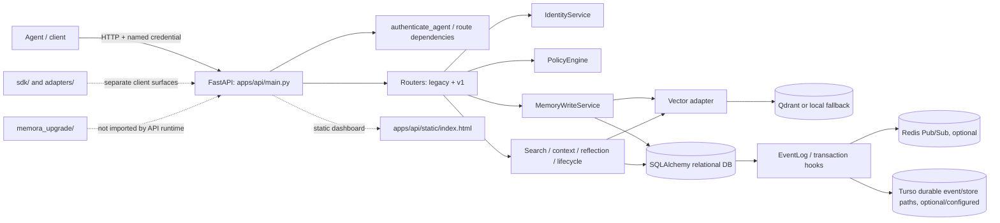
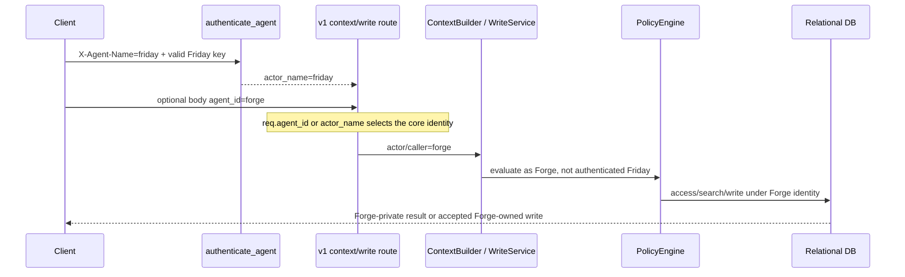
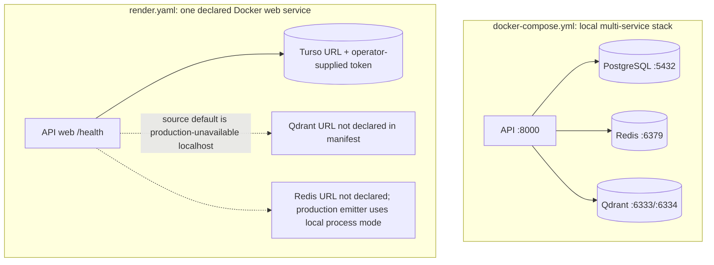

# Phase 14 — Findings synthesis, risk ledger and diagrams

**Status:** Baseline synthesis complete for the 2026-10-07 checkout. Phases 00–13 were reconciled against their evidence notes at that point. Source and tests have since changed; the post-remediation state and verification boundaries are appended below. This ledger is not a claim that the original findings remain unmitigated.

## Reconciliation and evidence rules

- [FACT] The checked-in Alembic history contains **9 revision scripts/revisions**. `git ls-files migrations` yields 11 tracked migration files total (the environment/template plus nine revisions), and the revision chain in `migrations/versions/` contains nine entries. Two intermediate evidence notes misstated this as eight and ten respectively; `phase-02-architecture-map.md` and `phase-11-tests-ci-quality.md` were corrected to nine. The migration-only upgrade/downgrade/upgrade result remains passed; the separate `create_all()`-then-upgrade collision remains a distinct reproduced failure.
- [FACT] `tests/` contains 50 tracked files, including 49 `test_*.py` modules. The source inventory counts 372 directly declared test functions and two test classes; parametrization creates more collected cases. Runtime pytest result is 434 passed, one strict xfailed, seven warnings.
- [FACT] 211 tracked files, 30,900 physical text lines, and the API route/test/domain counts are from repository inventory or generated OpenAPI, not estimates. See Phases 00, 03 and 11 for collection methods.
- [FACT] Runtime-security evidence is limited to local FastAPI TestClient requests with synthetic identities/records and isolated SQLite. Phase 0's probe set and Phase 12's reruns are not production penetration tests. Findings marked `[FACT]` are observed in the specified checkout/harness or directly visible in code/config; risk impact beyond that scope is marked `[INFERENCE]`; unresolved parser/deployment behavior is marked `[HYPOTHESIS]`.
- [FACT] No production or third-party service was contacted, and no source fix was attempted. The tracked Compose database credential alert and historical-report privacy concern remain open.

## Synthesized architecture and trust boundaries

### Runtime component map

[FACT] `apps/api/main.py:148-214` owns lifespan and mounts 15 routers. Core services directly import SQLAlchemy, vector, event, policy and metrics implementations (`core/memory/pipeline/write_service.py:12-23`; `core/memory/search_service.py:9-15`). The SDK/adapters/upgrade packages remain outside the runtime import path (Phases 02 and 09).

### Identity-to-data flow (observed break in principal binding)

[FACT] The substitution is explicit in `apps/api/routers/v1_context.py:48-63` and `apps/api/routers/v1_memories.py:209-234`; Phase 12 observed the corresponding private-read and write outcomes with synthetic data.

### Deployment topologies checked in the repository

[FACT] Compose declares four services and five host-published ports; Render declares one web service and uses `sync: false` secret slots. The checked-in Render manifest omits Qdrant and Redis service/configuration (`docker-compose.yml:1-65`; `render.yaml:1-57`). Phase 13 records the conditional `/health` consequence and the fact that no deployment was run.

## Risk ledger

Risk labels express potential impact if the code is reachable in a deployment matching the tested/configured path. “Confirmed” means the code behavior was directly observed in a local synthetic harness or directly read in tracked configuration; it is not evidence of exploitation of a real service. Risk levels are qualitative, not CVSS scores.

| ID | Severity | Finding and evidence | Confidence / boundary |
|---|---|---|---|
| R1 | **High** | Request-body `agent_id` can replace the key-authenticated principal for context retrieval and v1 writes. A Friday key read one Forge-private marker and wrote to Forge-private memory when body identity was Forge; omitted body identity was denied/returned no foreign record. (`apps/api/routers/v1_context.py:48-63`; `apps/api/routers/v1_memories.py:209-234`; Phase 12.) | Confirmed local HTTP behavior; cross-agent private disclosure and write impersonation. |
| R2 | **High** | Content-dedup/idempotency early returns can disclose an existing record before namespace policy evaluation. The isolated Phase 0 probe returned a victim record's ID and full text to a non-owner on an exact duplicate; code returns at `core/memory/pipeline/write_service.py:256-296` before policy at `:311-324`. | Confirmed local HTTP behavior; request requires a valid caller credential and matching existing content/key path. |
| R3 | **High** | `PUBLIC`/`UNIVERSE_GLOBAL` policy returns allowed without action checks. Phase 0 observed non-owner deletion; Phase 12 observed an ordinary Friday write into `memora://universe/global`. (`core/policy/engine.py:165-176`; `core/memory/service.py:457-465,524-535`; Phase 12 global-write result.) | Confirmed action-agnostic code; whether broad writes are an intended product choice is not documented consistently with “read” descriptions. |
| R4 | **High** | Reflection-insight listing has no tenant filter or per-record policy check. A Friday key received a synthetic insight from another tenant, HTTP 200. (`apps/api/routers/v1_reflection.py:57-95`.) | Confirmed local HTTP behavior; production impact depends on multiple tenants sharing the service/database. |
| R5 | **High** | Any authenticated caller can trigger decay without tenant scoping or admin check. A Friday key changed a synthetic other-tenant importance value from 0.90 to 0.56, HTTP 200. (`apps/api/routers/v1_memories.py:641-657`; `core/memory/service.py:634-659`; `core/lifecycle/decay.py:14-42`.) | Confirmed local mutation; all-tenant impact follows from omitted optional filter. |
| R6 | **High** | Legacy `POST /memories` accepts caller-supplied `VERIFIED` state/provenance and bypasses the canonical secret scanner. A synthetic semantic item returned 201 with verified metadata; the Phase 0/6 scanner fixture was accepted on legacy while v1 returned 422. (`apps/api/routers/memories.py:53-66`; `core/memory/service.py:135-170`; `core/memory/schemas.py:85-107`.) | Confirmed local behavior; potential trust poisoning and secret persistence. |
| R7 | **High, conditional** | Tracked Compose configuration contains literal local database credentials; it also publishes database/cache/vector ports with no host-IP restriction. (`docker-compose.yml:7-8,10,24-28,41-42,55-57`.) | Credential presence is confirmed; live reuse is not. Network exposure requires running the stack on a reachable host without firewall controls. Values are omitted. |
| R8 | **High availability/configuration** | Compose omits the per-agent keys the auth map requires; a Friday production-mode auth call without `FRIDAY_API_KEY` returns 503. Render omits Qdrant configuration; the production default adapter reports unavailable, which makes `/health` 503. (`docker-compose.yml:9-17`; `render.yaml:1-57`; `apps/api/dependencies.py:57-96`; `storage/vector/qdrant_adapter.py:43-83`; `apps/api/routers/health.py:39-54`.) | Configuration-derived and locally probed; external overrides may change deployed behavior. |
| R9 | **High reliability under concurrency** | One strict xfail reproduces an unresolved idempotency uniqueness race: 11 of 12 simultaneous SQLite writers failed when the case was forced to run. (`tests/test_idempotency_race_and_error_leakage.py:51-107`; Phase 11.) | Confirmed local stress outcome; production database/load may change frequency, not the invariant concern. |
| R10 | **Medium** | Legacy startup `create_all()` followed by Alembic upgrade collides at the access-grant table; fresh migration-only round-trip passes. (`storage/relational/session.py:177-182`; Phase 8 scratch failure; Phase 11 migration test.) | Confirmed SQLite ordering issue; Docker command migrates before Uvicorn, so not every startup sequence reproduces it. |
| R11 | **Medium release risk** | Offline wheel build fails because setuptools sees multiple flat-layout packages and there is no explicit package-discovery configuration (`pyproject.toml:1-4`; Phase 13). | Confirmed packaging attempt. Docker source-image build is untested and is a different path. |
| R12 | **Medium correctness** | Singleton context clusters bypass summarization/truncation; an 8,000-character memory under a 100-token budget returned unchanged at 2,000 estimated tokens (20×). (`core/memory/context/budgeter.py:85-87,227-270`; Phase 7.) | Confirmed helper-level local probe, not a full API response measurement. |
| R13 | **Medium classification** | Omitted semantic `source_type`/`trust_level` passes the v1 guard and is stored as candidate-trust semantic; explicit candidate is rejected. (`apps/api/routers/v1_memories.py:117-135`; `core/memory/pipeline/write_service.py:205-223,326-359`; Phase 12.) | Confirmed local write; stored as candidate, not verified. |
| R14 | **Medium privacy/contract** | Search's final union filter omits requested namespace/type constraints; predictive context prefetch also omits namespace/workspace/task filters. (`core/memory/search_service.py:132-191`; `core/memory/context/builder.py:142-210`.) | Static finding; policy filtering remains separate and no focused probe was run for every combination. |
| R15 | **Medium data-retention (baseline finding; locally addressed)** | The baseline soft-delete/direct-ID lifecycle gap was subsequently fixed. Turso hard-delete propagation now has a tombstone retry state and remote anti-resurrection fence; vector reconciliation handles soft-deleted rows. (`core/memory/service.py`; `storage/relational/turso_sync.py`; `core/resilience/self_healing.py`; Phases 16–17.) | Local SQL and mocked HTTP tests pass. Hosted Turso/Qdrant behavior, old remote orphan backfill, and distributed atomicity remain unverified. |
| R16 | **Medium privacy** | `context.generated` stores the task query in an event payload; configured Turso event synchronization sends that payload. (`core/memory/context/builder.py:265-276`; `core/events/emitter.py:118-139`; Phase 8.) | Conditional on Turso event sync; no query was transmitted externally in this review. |
| R17 | **Medium privacy/packaging** | Docker build context excludes tests/env/data but not the historical bug report or `notes/`; the report has personal information and Dockerfile uses `COPY . .`. (`.dockerignore:1-17`; `Dockerfile:12-16`; `MEMORA_PHASE2_BUG_REPORT.md:182,372`.) | Build-context inference; no image was built or inspected. Personal information is not reproduced. |
| R18 | **Medium tenant isolation (shared-default constraint remains)** | Event feed/cursor/ack and mesh ingestion bind to `tenant_id="default"`; agent authentication still has no tenant claim. Mesh ingestion now rejects agent-authored system events, overwrites payload tenant claims, and refuses local or Turso event-ID collisions owned by another tenant or publisher without returning their cursors. (`apps/api/routers/v1_events.py`; `storage/relational/turso_events.py`.) | Synthetic local regressions cover these event boundaries. This does not add general API multi-tenancy or verify hosted Turso behavior. |
| R19 | **Low correctness / contract follow-up** | The earlier claim that `learn-outcome` was absent is stale: `POST /v1/memories/learn-outcome` exists and its request fields match `MemoraClient.learn_from_outcome`. A positive SDK-to-API round trip now passes through local `TestClient` and isolated SQLite. The SDK does not expose the route's optional `namespace_path`; constructor-key differences still merit separate review. (`sdk/memora_client.py`; `apps/api/routers/v1_memories.py`.) | Local synthetic round trip only; no hosted endpoint, production credential, or external storage was used. |
| R20 | **Low–Medium observability/resilience (partially remediated)** | HALF_OPEN now reserves one generation-tagged probe; retrieval score/age/latency metrics are recorded, deduplication hits are separately counted, and collector updates/snapshots are synchronized; orphan checks page the tenant-filtered remote Qdrant API when initialized instead of trusting only the process-local mirror. The contradiction metric still has no genuine detector/callsite; the deduplication result exposes `duplicate_warning` for duplicate/overlap messages instead of the misleading `contradiction_warning` name. | Deterministic breaker regressions, local metrics concurrency/search tests, and fake-Qdrant reconciliation tests pass. Live Qdrant and external monitoring behavior remain unverified. |

### Risk tally and prioritization

- [FACT] The baseline ledger contains 20 grouped risks: **9 High** (R1–R9), **9 Medium** (R10–R18), and **2 Low–Medium** (R19–R20). This is the original risk count, not a count of still-open items after the continuation deltas below. The high findings split into six directly confirmed data-boundary behaviors (R1–R6), one confirmed but deployment-conditional credential/port exposure (R7), one availability/configuration issue (R8), and one load-sensitive reliability issue (R9).
- [INFERENCE] Immediate maintenance order should begin with authenticated-principal binding, pre-authorization dedup returns, action-specific public/global policy, tenant filters on reflection/decay, and legacy ingestion validation (R1–R6). Next, remove/rotate the committed Compose credentials and restrict service ports, then make deployment health/auth configuration explicit (R7–R8). Load races and migration/build path inconsistencies follow as reliability/release work (R9–R11).
- [FACT] These priority recommendations describe the original comprehension snapshot; subsequent remediation is documented in the post-remediation delta below and in Phases 16–17.

## Post-baseline remediation delta — 2026-10-08

This section records the current source/test state for the remaining R15 and R18–R20 items; the original risk table remains a baseline history, not a production assurance statement.

- **R15 / deletion convergence:** the local tombstone now tracks Turso replica deletion, migration `f35ecb0a7c12` records the state, the Turso path fences delayed upserts, and self-healing retries failed convergence. Soft-deleted and absent rows are removed from vector retrieval by bounded reconciliation. Tests cover local SQLite and mocked HTTP; no hosted Turso or Qdrant data was read or changed.
- **R18 / mesh-event isolation:** incoming agent envelopes cannot publish Memora-managed memory/context/access events; the server owns the stored tenant metadata; globally unique event-ID collisions with a foreign tenant or publisher return a generic conflict rather than another owner's cursor. Both the local DB and Turso append adapter enforce/check tenant ownership. The API still binds these event routes to the shared `default` tenant because credentials do not carry tenant claims.
- **R19 / SDK contract:** a synthetic `MemoraClient.learn_from_outcome` invocation was bridged through the real local API route and isolated SQLite; the stored record was an EXPERIENCE owned by the authenticated Friday principal. The earlier “route missing” assertion is withdrawn. Hosted credential injection and hosted storage remain untested.
- **R20 / resilience and observability:** a lock-protected, generation-tagged HALF_OPEN reservation admits only one probe; unexpected probe errors free that slot and stale completions cannot alter newer state. `SearchService` now records returned relevance/age and latency metrics; `MetricsCollector` updates and snapshots are synchronized; the write pipeline reports deduplication/idempotency hits as a separate metric. Initialized Qdrant reconciliation uses tenant-filtered scroll pages, with a per-tenant in-process cursor. The contradiction counter remains unpopulated by design because the code has duplicate/overlap detection, not a true contradiction detector; no duplicate is treated as a contradiction.
- **Packaging:** package-local `migrations/alembic.ini` is included in the wheel. A temporary wheel install executed `alembic upgrade head` and `alembic current` from outside the source tree against isolated SQLite and reported `f35ecb0a7c12 (head)`. YAML parsing passed for the Compose and Render files. Docker/Compose CLI and image build remain unavailable.
- **Verification:** the full local suite passed **512 tests in 30.50s**; the updated concurrency/idempotency/circuit-breaker/metrics battery passed **31 tests in each of three rounds** (3.01s, 3.18s, 3.53s). Ruff, `git diff --check`, and Alembic head checks passed.
- **Open operational risks:** a credential remains in pre-existing Git history even though the current Compose configuration was sanitized; rotation/revocation and history remediation are not verified. No production secrets, hosted Turso/Qdrant, Docker image, Render deployment, or live multi-tenant credential mapping was exercised.

## Exit check

- [FACT] Evidence from all 14 prior phases is reconciled and high-impact risks are separated from static or conditional concerns. Counts and migration discrepancies are corrected. Diagrams distinguish runtime components, request identity flow, and checked-in deployment topology.
- [FACT] Phase 14 is complete. Phase 15 will run the final report acceptance checklist and then create `REPO_ANALYSIS.md`.
